# Analysis of the 6000+ Indian Food Recipes Dataset

This dataset contains 6871 recipes and related metadata scraped from Archana's Kitchen website. 
The dataset contains the columns: 'RecipeName', 'TranslatedRecipeName', 'Ingredients', 'TranslatedIngredients', 'Prep', 'Cook', 'Total', 'Servings', 'Cuisine', 'Course', 'Diet', 'Instructions', 'TranslatedInstructions'

As some of the ingredients and instructions are given in Hindi, the Google Cloud API translations to English are provided, however, some of the entries are not translated and remain in Hindi. Language ID on the text can be done and rows detected as Hindi can be dropped. 

Some of the exploratory data analysis is shown below:

### Word cloud of ingredients in the dataset:

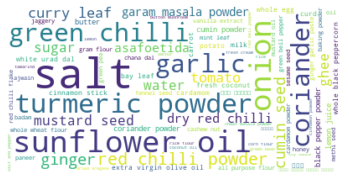

### Word cloud of cuisines:

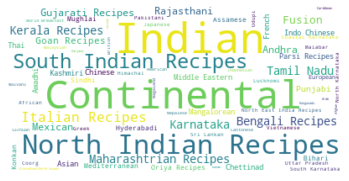

### Distribution of courses:

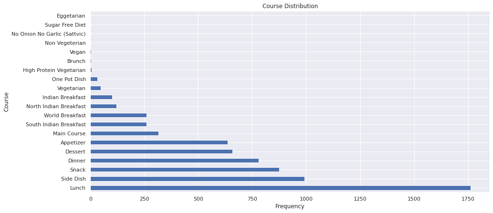

### Distribution of cuisines:

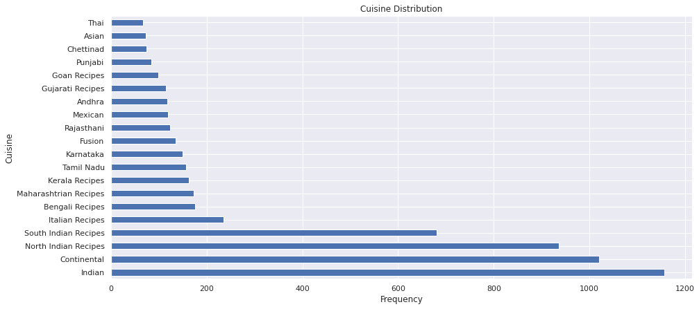

### Box plots for prep time, cook time, total time (prep + cook time):

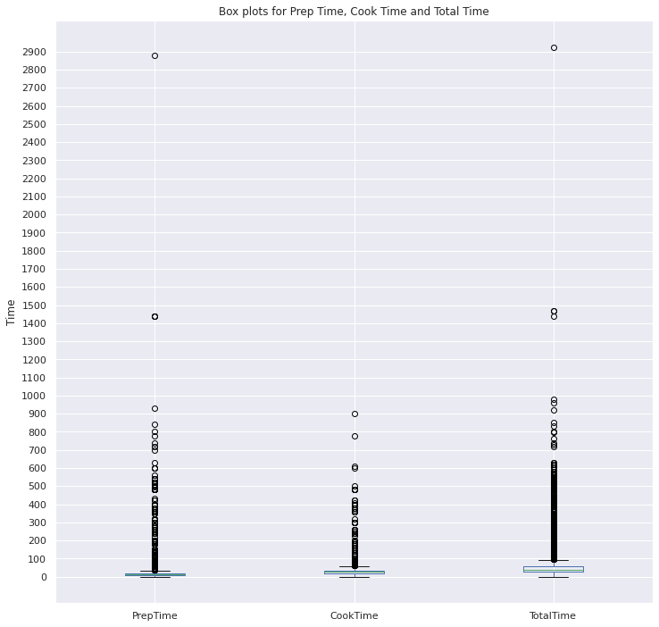

### Total Time per Course:

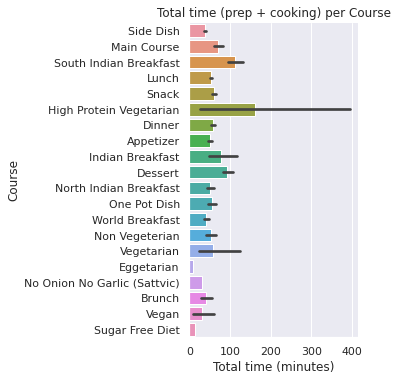

### Total Time per Cuisine:

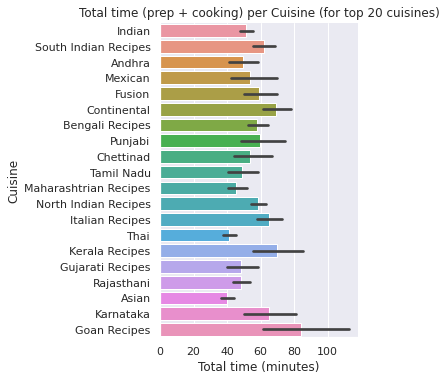

### Total Time per Diet:

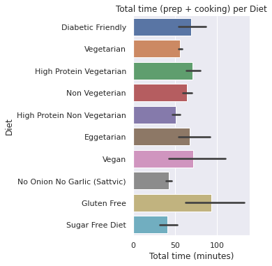

### Cuisine-wise word clouds of ingredients:

North Indian Recipes:

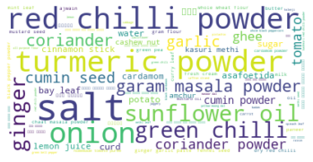

South Indian Recipes:

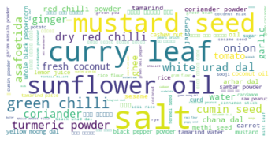

Bengali Recipes:

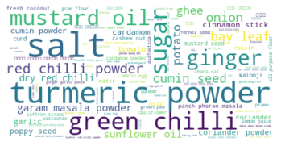

Continental:

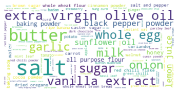

Indian:

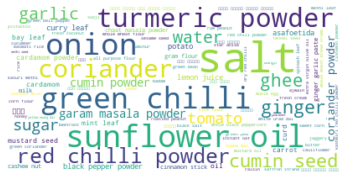

Italian Recipes:

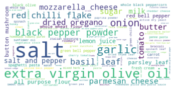

Kerala Recipes:

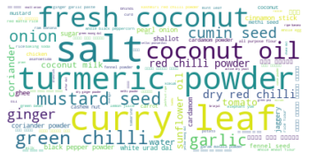

Maharashtrian Recipes:

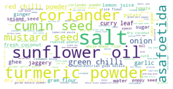

Tamil Nadu:

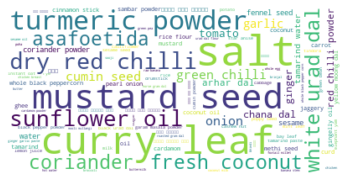

Karnataka:

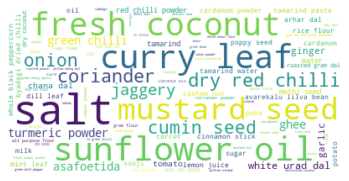

We can clearly see that the most prominent elements in the word cloud, e.g. coconut oil for Kerala, extra virgin olive oil for continental, curry leaf for south indian cuisine represent the most distinguishing ingredients for each cuisine.

## Questions:
1. Filtering based on ingredient + cooking time (e.g. onion/variation of onion/shallots + 30 min cooking time)
If we load the data as a pandas dataframe, it can be accessed by checking if the ingredient list has the word 'onion' or 'shallot' along with a condition on cooktime, for e.g.:
```
df[( df['TranslatedIngredients'].str.contains('onion') | df['IngredientCommaSep'].str.contains('shallot') ) & ( df['CookTimeInMins'] == 30 )]
```
2. How do you find similar dishes in the dataset, and how do you measure degree of similarity/dissimilarity?

 - One simple way we can measure similarity is to preprocess the translated ingredients to distill only the ingredient names (as shown in the jupyter notebook in this repository), and use jaccard similarity on ingredients (intersection over union) to predict the similarity. However, this would weigh all ingredients equally (e.g. salt), which would not make it a good measure. To weigh the ingredients based on their interestingness, we can calculate inverse document frequency (idf) weights of each ingredient, where a document is a row (dish) in the dataset which contains the ingredients as its content. Jaccard similarity multiplied by the idf of the ingredient would be a better measure of similarity of two dishes.
 - But this method does not take into consideration similar ingredients with different names (onions/shallots) - averaging Word2Vec embeddings of the ingredients and calculating cosine similarity could be another way to calculate similarity between dishes.
3. How would you recommend a gluten free sweet dish from this dataset?

Loading the dataset as a pandas dataframe, we can filter the data on Diet='Gluten Free' and and Course='Dessert' to filter dishes that are gluten free and sweet. 

## More ideas for this dataset:
- Word2vec fine-tuned on this dataset (ingredient2vec) to find similar ingredients (ingredients which have high cosine similarity) 
which could be used to recommend substitute ingredients - an additional check from the dataset if it is vegan would make it a vegan substitute recommendation 
(e.g. chicken can be substituted with tofu/paneer) 
- Another high level idea is that we could train a recipe generator for this dataset (maybe an LSTM), trained to predict the recipe given the ingredients. Ideally with enough data, it should be able to predice new recipes given new combinations of ingredients which could be a useful tool for chefs to come up with new ideas. We can also tweak this model to perform style transfer over different cuisines (generating recipes based on the cuisine) with the same ingredients, by adding the cuisine as another input along with the ingredient while training the model. 
- Some practical things this dataset can be used for is to recommend dishes based on cooking time available, cuisine and course
